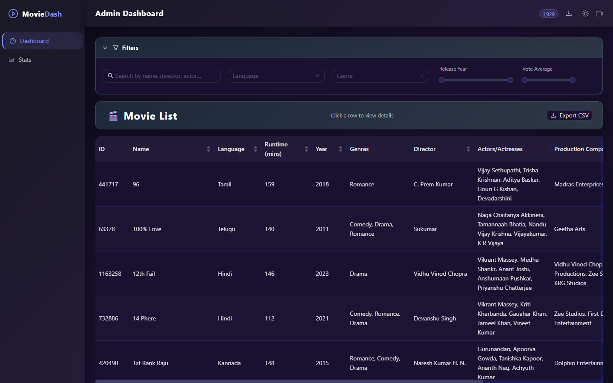
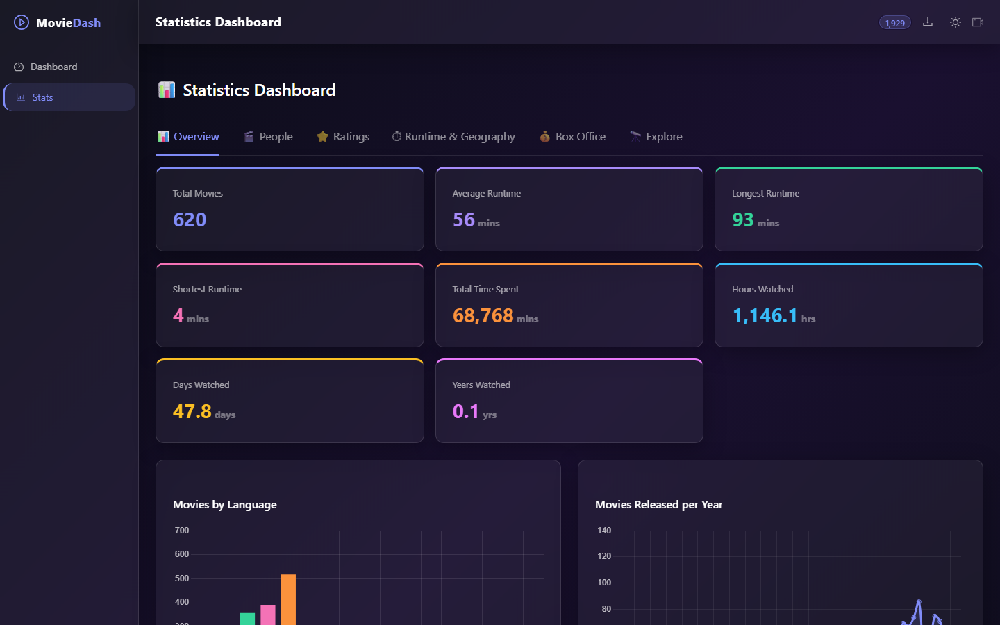
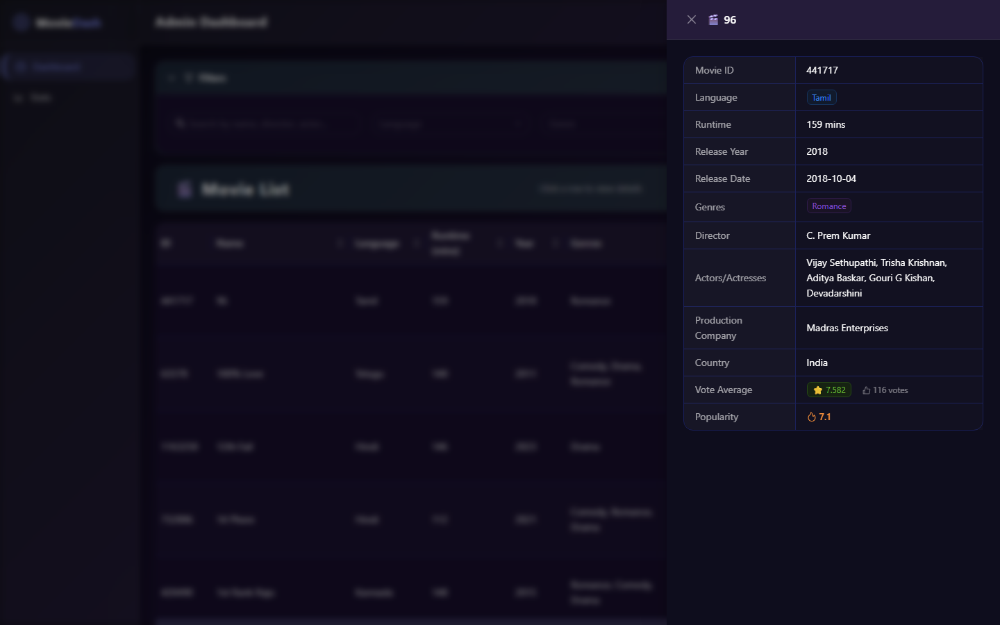
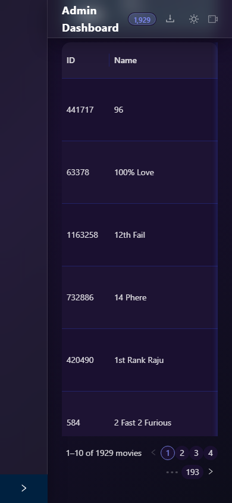

# MovieDash v2

A full-stack movie analytics dashboard: a React frontend backed by an Express API, serving data from a local CSV. Browse, filter, and explore a movie dataset through an interactive table and rich statistics visualisations — with a light/dark theme toggle.

[](https://github.com/SanjayJoshi116/movie-dash-v2/actions/workflows/ci.yml)
[](./LICENSE)


**Highlights:** 6 analytics tabs · Express API with gzip + caching · CSV export · 40 Playwright E2E tests · light/dark theme · filter state persisted to `localStorage`

No hosted demo — this project runs locally against your own CSV dataset. See [Getting Started](#getting-started).

---

## Screenshots

| Dashboard | Statistics |
|---|---|
|  |  |

| Movie Detail Drawer | Mobile |
|---|---|
|  |  |

---

## Features

### Dashboard
- Searchable, filterable movie table (name, director, actor, genre, production company)
- Multi-select language and genre filters, year range and vote average sliders
- Filter state persisted across page refreshes (localStorage)
- Sortable columns, pagination (5 / 10 / 20 / 50 per page)
- Click any row to open a detail drawer with full movie info, vote count, and popularity score
- Export filtered results to CSV

### Statistics — 6 tabs
| Tab | Contents |
|---|---|
| 📊 Overview | Animated stat cards (total, avg/longest/shortest runtime, total watch time in mins/hrs/days/yrs) · Movies by language · Movies per year |
| 🎬 People | Top 15 actors · Top 15 directors · Movies by production company |
| ⭐ Ratings | Vote distribution · Avg vote by language (radar) · Avg vote by genre |
| ⏱ Runtime & Geography | Movies by country & genre (polar area) · Avg vote by runtime bucket · Top 50 longest films |
| 💰 Box Office | Top 20 highest-grossing films · Top 20 highest-budget films · Avg revenue by genre |
| 🔭 Explore | Genre distribution · Year × genre heatmap · Top 10 Explorer (highest rated, longest, most recent, oldest, most popular) |

### Theme
- Light / dark toggle (sun/moon button in the top bar)
- Preference persisted to `localStorage`
- Glassmorphism design system with CSS custom properties

---

## Tech Stack

| Layer | Technology |
|---|---|
| Frontend | React 19, TypeScript, Vite 6 |
| UI | Ant Design v5 (dark + light algorithm) |
| Charts | Chart.js 4 + react-chartjs-2, chartjs-chart-matrix |
| Animation | Framer Motion |
| Routing | React Router v7 |
| HTTP | Axios |
| Backend | Express.js (TypeScript, tsx) |
| Data | CSV file via csv-parser |
| Testing | Playwright (40 E2E tests) |
| Linting | ESLint (typescript-eslint, react-hooks, unused-imports) |

---

## Getting Started

Requires **Node.js 20+**.

### 1. Install dependencies

```bash
npm install
```

### 2. Add your data

The repository ships with a CSV template at `public/movies.template.csv`. Copy it to `src/movies.csv` and populate it with your data:

```bash
cp public/movies.template.csv src/movies.csv
```

The expected columns are:

```
Movie ID, Name, Language, Runtime, Release Year, Genres, Director,
Actors/Actresses, Production Company, Production Country,
Box Office Revenue, Budget, Popularity Score, Vote Average,
Vote Count, Release Date
```

- **Language** — ISO 639-1 code (`en`, `fr`, `ja`, …)
- **Genres** — comma-separated (`Action, Adventure`)
- **Box Office Revenue / Budget** — plain numbers (e.g. `150000000`)
- **Release Date** — `YYYY-MM-DD`

A download button in the top bar also lets users grab the template directly from the running app.

`src/movies.csv` is gitignored and read by the Express server at runtime — it isn't placed in `public/` because it's not a static asset the browser fetches directly; the frontend only ever sees it through the `/movies` API. Keeping it out of `public/` also keeps it out of the Vite production bundle.

#### Where to get the data — TMDB API

This project was populated using the [TMDB (The Movie Database) API](https://www.themoviedb.org/documentation/api), which is free for non-commercial use. This product uses the TMDB API but is not endorsed or certified by TMDB — check [TMDB's terms of use](https://www.themoviedb.org/documentation/api/terms-of-use) before using fetched data beyond personal/non-commercial purposes.

1. Create a free account at [themoviedb.org](https://www.themoviedb.org) and generate an API key under **Settings → API**.
2. Use the [`/discover/movie`](https://developer.themoviedb.org/reference/discover-movie) endpoint to fetch movies in bulk, paginating through results.
3. For each movie, map the TMDB fields to the CSV columns:

| CSV column | TMDB field |
|---|---|
| `Movie ID` | `id` |
| `Name` | `title` |
| `Language` | `original_language` |
| `Runtime` | `runtime` (from `/movie/{id}`) |
| `Release Year` | `release_date` (year part) |
| `Genres` | `genres[].name` joined with `, ` |
| `Director` | `credits.crew` where `job == "Director"` |
| `Actors/Actresses` | `credits.cast[0..4].name` joined with `, ` |
| `Production Company` | `production_companies[0].name` |
| `Production Country` | `production_countries[0].iso_3166_1` |
| `Box Office Revenue` | `revenue` |
| `Budget` | `budget` |
| `Popularity Score` | `popularity` |
| `Vote Average` | `vote_average` |
| `Vote Count` | `vote_count` |
| `Release Date` | `release_date` |

`credits` and `keywords` require appending `append_to_response=credits,keywords` to the `/movie/{id}` request.

#### Or use the included search tool

`movie-search.py` is a small Tkinter GUI that does the above for you — search TMDB by movie or actor name, filter by language, and append picked results straight to `src/movies.csv`. It checks `Movie ID` against existing rows first and skips (with a dialog) anything already in the CSV, so re-running a search is safe.

```bash
pip install -r requirements.txt
cp .env.example .env   # then set TMDB_API_KEY=<your key> in .env
python movie-search.py
```

`.env.example` contains a single placeholder line:

```
TMDB_API_KEY=your_tmdb_api_key_here
```

`.env` is gitignored — the key never gets hardcoded or committed.

### 3. Run

```bash
npm run dev
```

Opens the frontend at **http://localhost:3000** and the API at **http://localhost:5000**.

---

## Scripts

### Development
| Script | Description |
|---|---|
| `npm run dev` | Start Vite dev server + Express backend concurrently |
| `npm run preview` | Preview the production build locally |

### Build
| Script | Description |
|---|---|
| `npm run build` | Type-check and build frontend for production (`dist/`) |
| `npm run build:server` | Compile Express backend to `server/dist/` |
| `npm run server:prod` | Run the compiled backend in production |
| `npm run type-check` | Run TypeScript type checking without emitting files |

### Testing
| Script | Description |
|---|---|
| `npm run lint` | Run ESLint across the project |
| `npm run test:e2e` | Run Playwright E2E tests (headless) |
| `npm run test:e2e:ui` | Run Playwright E2E tests with interactive UI |
| `npm run test:e2e:report` | Open the last Playwright HTML report |

---

## Project Structure

React talks only to the Express API (`/movies`, `/movies/:id`, `/health`); the API is the sole reader of the CSV, so the frontend never touches the filesystem directly.

```
React (Vite, port 3000) → Express API (port 5000) → src/movies.csv → Chart.js / Ant Table
```

```
movie-dash-v2/
├── public/
│   └── movies.template.csv     # CSV template for your own data
├── server/
│   └── server.ts               # Express API (port 5000)
├── tests/
│   └── app.spec.ts             # Playwright E2E tests (40 tests)
├── docs/
│   └── screenshots/            # README screenshots
├── playwright.config.ts        # Playwright configuration
├── src/
│   ├── contexts/
│   │   ├── MoviesContext.tsx    # Global movie data provider
│   │   └── ThemeContext.tsx     # Light/dark theme provider
│   ├── components/
│   │   ├── Charts/             # BarChart, LineChart, HorizontalBar, Radar,
│   │   │                       # PolarArea, Doughnut, Matrix (all theme-aware)
│   │   ├── StatsTabs/          # OverviewTab, PeopleTab, RatingsTab,
│   │   │                       # RuntimeTab, BoxOfficeTab, ExploreTab
│   │   ├── Sidebar.tsx
│   │   ├── TopBar.tsx          # Theme toggle + download template button
│   │   ├── FiltersPanel.tsx
│   │   ├── MovieTable.tsx
│   │   ├── MovieDrawer.tsx
│   │   ├── StatCard.tsx
│   │   └── TopNExplorer.tsx
│   ├── pages/
│   │   ├── Dashboard.tsx
│   │   └── Stats.tsx
│   ├── utils/
│   │   ├── chartTheme.ts       # Shared palette + getCardStyle(isDark)
│   │   ├── statsHelpers.ts     # groupByField, parseRevenue, formatRevenue
│   │   ├── exportCsv.ts
│   │   └── languages.ts        # ISO code → display name
│   ├── hooks/
│   │   ├── useMovies.ts
│   │   ├── useDebounce.ts
│   │   └── usePersistedFilters.ts
│   └── types/
│       └── movie.ts
```

---

## E2E Testing

Playwright tests cover the full user journey across 7 suites (40 tests):

- **Dashboard** — layout, search, language/genre filters, empty state, drawer, CSV export, sorting, pagination, collapse panel
- **Navigation** — sidebar links, 404 page, back-to-dashboard, sidebar collapse, page title updates
- **Stats Page** — all 6 tabs load, charts render, TopN explorer metric switching, tab persistence
- **Theme** — default dark, toggle to light, reload persistence
- **Filter Persistence** — search filter survives route changes via localStorage
- **Edge Cases** — combined filters, pagination, sort + filter combo

Tests run automatically on every push and pull request to `main` via GitHub Actions (see `.github/workflows/ci.yml`).

### Run tests locally

```bash
# Install browsers (first time only)
npx playwright install chromium

# Run headless
npm run test:e2e

# Interactive UI mode
npm run test:e2e:ui

# View HTML report after a run
npm run test:e2e:report
```

Tests require both the Vite frontend (port 3000) and Express backend (port 5000) to be reachable. The Playwright config starts `npm run dev` automatically if no server is already running.

---

## API

The Express server exposes JSON endpoints:

| Endpoint | Description |
|---|---|
| `GET /health` | `{ status: "ok" \| "loading", movies: <count> }` |
| `GET /movies` | All movies as a JSON array. Returns `503 { error: "Data still loading" }` while the CSV is still being read on boot |
| `GET /movies/:id` | A single movie by `Movie ID`. Returns `404 { error: "Movie not found" }` if no match |

Responses are gzip-compressed and `/movies` is cached with `Cache-Control: public, max-age=60`. In development, Vite proxies `/movies` requests to the Express server automatically (see `vite.config.ts`).

---

## Performance

- **gzip compression** on all API responses (`compression` middleware)
- **HTTP caching** — `/movies` sent with `Cache-Control: public, max-age=60`
- **Debounced search** — table search input debounced via `useDebounce` to avoid re-filtering on every keystroke
- **Single fetch, shared context** — movie data fetched once in `MoviesContext` and reused across the dashboard and all stats tabs, not re-fetched per component
- **Code splitting** — Vite production build splits vendor/chart bundles

---

## Deployment

- **Frontend**: `npm run build` outputs a static `dist/` — deploy to any static host (Vercel, Netlify, GitHub Pages, S3 + CDN).
- **Backend**: `npm run build:server` compiles the Express API to `server/dist/`; run it with `npm run server:prod` on any Node 20+ host (Render, Railway, a VPS, etc.). Point the frontend's API calls at the deployed backend URL, or serve both behind the same reverse proxy.
- Neither is deployed anywhere by default — this is a local-first project (see [Live Demo note](#moviedash-v2) above).

---

## Roadmap

Ideas under consideration, not commitments:

- Pluggable data backend (SQLite/Postgres) as an alternative to CSV
- Basic auth for multi-user deployments
- Dockerfile / docker-compose for one-command setup
- Bulk CSV import/export improvements in `movie-search.py`

---

## Contributing

1. Fork the repo and create a branch off `main`.
2. Make your changes, keeping with the existing code style (`npm run lint`).
3. Run `npm run lint` and `npm run test:e2e` before opening a PR.
4. Open a PR describing the change and why.

---

## License

MIT — see [LICENSE](./LICENSE).

---

## Changelog

See [CHANGELOG.md](./CHANGELOG.md) for release notes. See [features.txt](./features.txt) for a plain-text feature list, and [CLAUDE.md](./CLAUDE.md) for repo/architecture notes aimed at AI coding agents.
